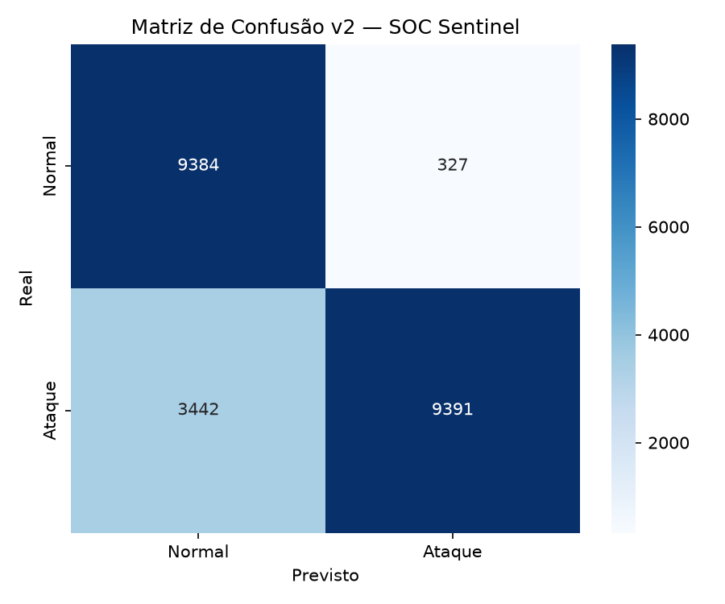
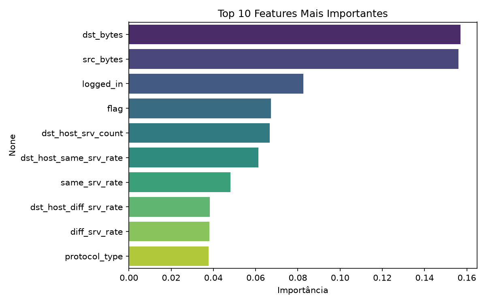

# SOC Sentinel
Plataforma de detecção de ameaças combinando SIEM local (Wazuh) com modelo de machine learning treinado no dataset NSL-KDD.

## Utilidade

- Monitora eventos do sistema operacional em tempo real via Wazuh
- Detecta comportamentos maliciosos com regras mapeadas ao MITRE ATT&CK
- Classifica trafego de rede como normal ou ataque usando Random Forest

## Resultados do modelo

| Metrica | Valor |
|---|---|
| Acuracia | 83% |
| Precisao (ataques) | 97% |
| Recall (ataques) | 73% |
| Dataset | NSL-KDD (125.973 registros) |

## Tecnologias usadas

Python | scikit-learn | Docker | Wazuh | OpenSearch | pandas | seaborn

## Como rodar

```bash
# 1. Subir o SIEM
cd wazuh
sudo docker-compose up -d

# 2. Treinar o modelo
cd ../ml
pip3 install pandas scikit-learn matplotlib seaborn --user
python3 train_model.py

# 3. Analisar alertas
python3 analyze_alerts.py
```

## Gráficos




